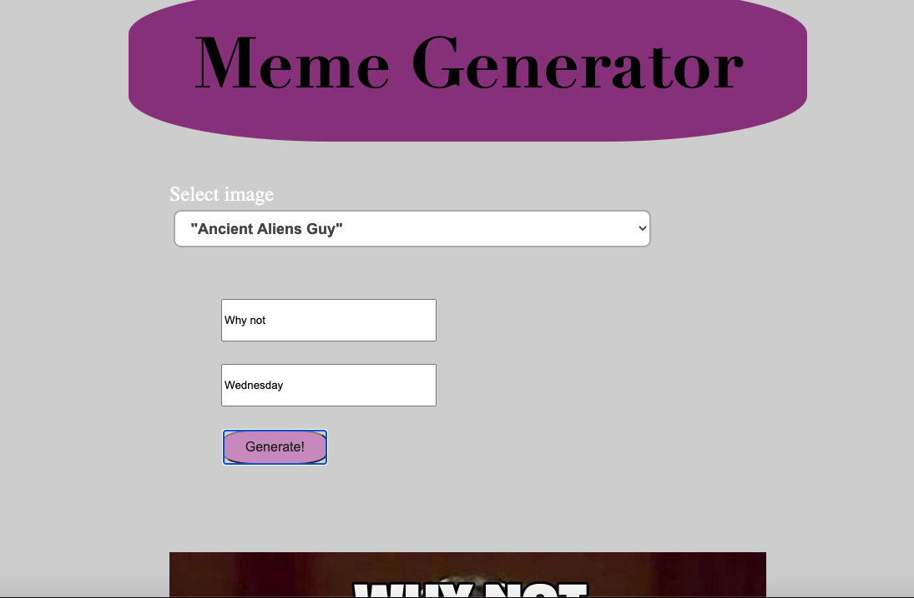
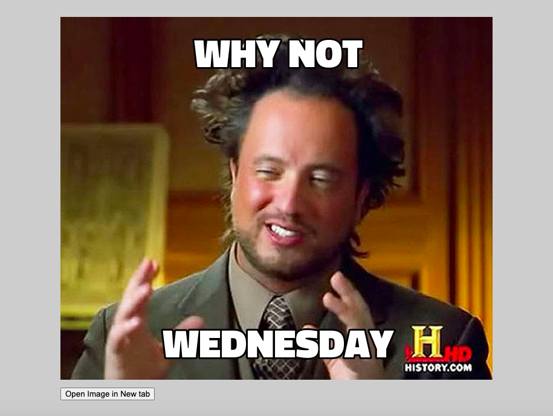

# React Meme Generator

Uses http://memegen.link to pull templates
Displays text in field and over image before generating
Opens image in new tab to download
Created in Sept 2020 by Jenna Koelbl
Using React Hooks, useState and useEffect

## Code Sandbox

codesandbox.io/s/github/jaylenej27/meme-react

## Netlify

ecstatic-kirch-89e3e2.netlify.app

## Input screen

## Meme example

